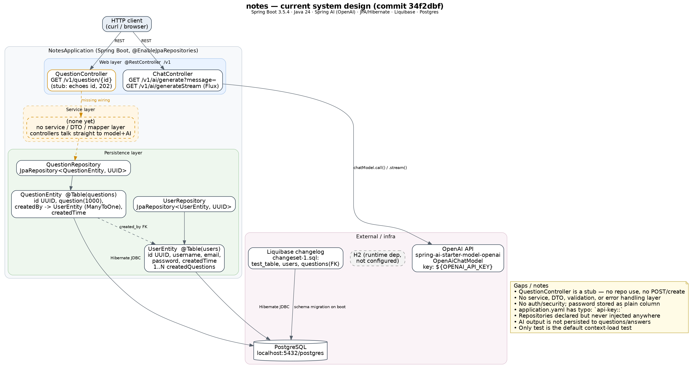

# notes — system design (current state)

Diagram source: [`system-design.dot`](system-design.dot) (regenerate with `dot -Tpng -Gdpi=150 docs/system-design.dot -o docs/system-design.png`).

## Stack

Spring Boot 3.5.4, Java 24, Spring AI (OpenAI, 1.0.0-SNAPSHOT), Spring Data JPA/Hibernate, Liquibase, PostgreSQL, Lombok. H2 is on the runtime classpath but not configured.

## Components

| Layer | Component | Notes |
| --- | --- | --- |
| Web | `ChatController` (`/v1`) | `GET /v1/ai/generate?message=` (sync) and `GET /v1/ai/generateStream` (`Flux<ChatResponse>`), both delegating to `OpenAiChatModel` |
| Web | `QuestionController` (`/v1`) | `GET /v1/question/{id}` — stub that echoes the path variable with HTTP 202 |
| Service | — | no service/DTO/mapper layer yet |
| Data | `UserRepository`, `QuestionRepository` | `JpaRepository<…, UUID>`; declared but not injected anywhere |
| Data | `UserEntity` (`users`), `QuestionEntity` (`questions`) | `questions.created_by` → `users.id` (`@ManyToOne`), inverse `users.createdQuestions` |
| Infra | Liquibase `changeset-1.sql` | creates `test_table`, `users`, `questions` (with FK) on boot |
| Infra | PostgreSQL | `jdbc:postgresql://localhost:5432/postgres` |
| Infra | OpenAI API | key from `${OPENAI_API_KEY}` |

## Request flows

- Chat: client → `ChatController` → `OpenAiChatModel` → OpenAI API → response returned directly; nothing is persisted.
- Question: client → `QuestionController` → returns the id. No repository, database, or AI involvement yet.

## Known gaps

- `QuestionController` is a stub: no create endpoint, no repository usage.
- No service, DTO, validation, or error-handling layer.
- No authentication/authorization; `users.password` is a plain column with no hashing.
- `application.yaml` has a typo: `api-key::` under `spring.ai.openai`.
- AI responses are never stored, so questions and answers are not linked.
- `test_table` from the first changeset is unused.
- Only test is the default `contextLoads` application test.
